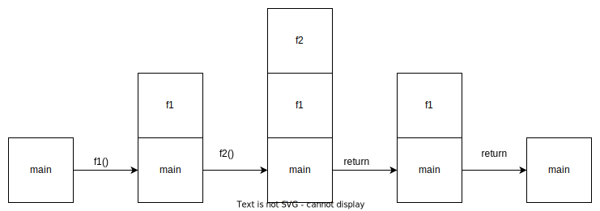

# An Introduction to Programming in Go: notes for chapters 7

Book by Caleb Doxsey.

<!-- markdownlint-disable MD010 -->

## Sections

- [An Introduction to Programming in Go: notes for chapters 7](#an-introduction-to-programming-in-go-notes-for-chapters-7)
  - [Sections](#sections)
  - [Notes](#notes)
  - [Functions](#functions)
  - [The `...` operator](#the--operator)
  - [Closure: Functions inside functions](#closure-functions-inside-functions)
  - [Recursion](#recursion)
  - [Function Management: Defer, Panic, and Recover](#function-management-defer-panic-and-recover)
  - [Defer](#defer)
    - [Panic and Recover](#panic-and-recover)
  - [Exercises: Chapter 7](#exercises-chapter-7)
    - [Question 2: Divide by 2 and check even or odd](#question-2-divide-by-2-and-check-even-or-odd)
  - [Additional notes](#additional-notes)
    - [Language specific](#language-specific)

## Notes

## Functions

- Functions map input parameters to output parameters.
- Functions in `go` start with the keyword `func` and the function name. Followed by the paramters in (), and then the return type.
- Function body is written between a pair of curly braces.
- The `panic` function causes a runtime error.

```go
// functions.go
package main

import "fmt"

func main() {
	numbers := [5]float64 {98, 93, 77, 82, 83}

	var total float64 = 0
	for i := 0; i < len(numbers); i++ {
		total += numbers[i]
	}
	fmt.Println(total / float64(len(numbers)))
}

func average(numbers []float64) float64 {
    panic("Not implemented")
}
```

- We implement the average function and modify the main function to print the output of average function.

```go
// functions.go
package main

import "fmt"

func main() {
	numbers := [5]float64 {98, 93, 77, 82, 83}

	fmt.Println(average(numbers[:]))
}

func average(numbers []float64) float64 {
    var total float64 = 0
	for i := 0; i < len(numbers); i++ {
		total += numbers[i]
	}
	return total / float64(len(numbers))
}
```

- We run the program using `go run.`

```powershell
intro-to-prog-in-go-caleb-doxsey/programs/ch7 on  gobook [!?] via 🐹
v1.17.2 on ☁️  (us-east-1)
❯ go run .\functions.go
86.6
```

- Functions don't have access to anything in the calling function.
- Functions are built up in a stack.

```go
// functions2.go
package main

import "fmt"

func main() {
	fmt.Println(f1())
}

func f1() int {
	return f2()
}

func f2() int {
	return 2
}

```

- Each call to a functiion pushes it onto a call stack, and each timer a return occurs, we pop the last function off the stack (LIFO).
  
- Return type can also be named.
- Multiple values can also be returned.

```go
// functions3.go
package main

import "fmt"

func main() {
	NamedReturnFunction()
    first, second := MultipleReturnedValues()
    fmt.Println(first, second)
}

func NamedReturnFunction() (returned_value int) {
	returned_value = 1
	return
}

func MultipleReturnedValues() (int, int) {
	return 5, 6
}

```

## The `...` operator

- Using `...` before the type indicator name of the last parameter in a function, we can indicate that this parameter takes one or more of that type of parameters.
- If we do `args ... int` we specify that there can be multiple `int` variables in the `args` variable, which is of type `[]int`, which is a slice of ints.
- We can also pass a slice using `...` after the name of the slice like `nums...`.
- We can check the type of a variable using `reflect.TypeOf`.

```go
// functions4.go
package main

import (
	"fmt"
	"reflect"
)

func main() {
	fmt.Println(add(1,2,3))
    nums := []int{1,2,3,4,5,6,7,8,9,10,0}
    fmt.Println(add(nums...))
}

func add(args ...int) int {
	total := 0
	for _, value := range args {
		total += value
	}
    fmt.Println(reflect.TypeOf(args))
	return total
}
```

```powershell
intro-to-prog-in-go-caleb-doxsey/programs/ch7 on  gobook [!?] via 🐹
v1.17.2 on ☁️  (us-east-1)
❯ go run .\functions4.go
[]int
6
[]int
55
```

## Closure: Functions inside functions

- Functions can be inside functions.

```go
// functions5.go
package main

import "fmt"

func main(){
    add := func (x, y int) int {
        return x + y
    }
    fmt.Println(add(1,1))
    x := 0
    increment := func() int {
        x++
        return x
    }
    fmt.Println()
    for x < 5 {
        fmt.Println(increment())
    }
}
```

```powershell
intro-to-prog-in-go-caleb-doxsey/programs/ch7 on  gobook [!?] via 🐹 v1.17.6 on ☁️  (us-east-1) 
❯ go run functions5.go
2

1
2
3
4
5

intro-to-prog-in-go-caleb-doxsey/programs/ch7 on  gobook [!?] via 🐹 v1.17.6 on ☁️  (us-east-1) 
❯ 
```

- Here, we are creating a function and saving it to the variable `add`. It will have access to other local variables.
- In the function signature, we declare both `x` and `y` together as int with `(x, y int)`.
- We can see that the `increment` function has access to the local variable x.
- A function assigned to a variable and access to variables not local to it is called a closure.
- This can be used to create custom generators.

```go
// functions6.go
package main

import "fmt"

func main(){
    nextEven := makeEvenGenerator()
    fmt.Println(nextEven())
    fmt.Println(nextEven())
}

func makeEvenGenerator() func() uint {
    i := uint(0)
    return func() (ret uint){
        ret = i
        i += 2
        return
    }
}

```

```powershell
intro-to-prog-in-go-caleb-doxsey/programs/ch7 on  gobook [!?] via 🐹 v1.17.6 on ☁️  (us-east-1) 
❯ go run functions6.go
0
2

intro-to-prog-in-go-caleb-doxsey/programs/ch7 on  gobook [!?] via 🐹 v1.17.6 on ☁️  (us-east-1) 
❯
```

## Recursion

- Functions can call themselves.

```go
// functions7.go
package main

import "fmt"

func factorial(x uint) uint {
	if x == 0 {
		return 1
	}
	return x * factorial(x-1)
}

func main() {
    fmt.Println(factorial(3))
}

```

```powershell
intro-to-prog-in-go-caleb-doxsey/programs/ch7 on  gobook [!?] via 🐹 v1.17.6 on ☁️  (us-east-1)
❯ go run functions7.go
6

intro-to-prog-in-go-caleb-doxsey/programs/ch7 on  gobook [!?] via 🐹 v1.17.6 on ☁️  (us-east-1) 
❯
```

## Function Management: Defer, Panic, and Recover

- Go has `defer`, `panic`, and `recover` to manage functions.

## Defer

- `defer` schedules a function to run after current function complete's it's execution.

```go
// functions8.go
package main

import "fmt"

func firstFunction() {
	fmt.Println("First function executes")
}

func secondFunction() {
	fmt.Println("Second function executes")
}

func main() {
	defer firstFunction()
	secondFunction()
}

```

- Here we defer the first function to run after the main function has finished executing.
- The `firstFunction` will execute after the `secondFunction`, even though the `firstFunction` has been called first, because it has been deferred.

```powershell
intro-to-prog-in-go-caleb-doxsey/programs/ch7 on  gobook [!?] via 🐹 v1.18 on ☁️  (us-east-1)
❯ go run functions8.go
Second function executes
First function executes

intro-to-prog-in-go-caleb-doxsey/programs/ch7 on  gobook [!?] via 🐹 v1.18 on ☁️  (us-east-1)
❯
```

- Deferred functions occur at the end of the current function's execution. A return from the current function will happen after the defer call.

```go
// functions9.go
package main

import "fmt"

func firstFunction() {
    fmt.Println("firstFunction executes")
}

func secondFunction() int{
    defer firstFunction()
    fmt.Println("secondFunction executes")
    return 10
}

func main() {
    fmt.Printf("Output returned from second function: %d\n", secondFunction())
    fmt.Println("main function executes")
}
```

- Here we can see that the deferred function executes before the value is returned from the `secondFunction`.

```powershell
intro-to-prog-in-go-caleb-doxsey/programs/ch7 on  gobook [!?] via 🐹 v1.18 on ☁️  (us-east-1)
❯ go run functions9.go
secondFunction executes
firstFunction executes
Output returned from second function: 10
main function executes

intro-to-prog-in-go-caleb-doxsey/programs/ch7 on  gobook [!?] via 🐹 v1.18 on ☁️  (us-east-1)
❯
```

- Deferred fuctions run even if there is a runtime panic.

```go
// functions10.go
package main

import "fmt"

func firstFunction() {
    fmt.Println("firstFunction executes")
}

func secondFunction() int{
    defer firstFunction()
    fmt.Println("secondFunction starts")
    panic("Intentional panic in secondFunction")
    return 10
}

func main() {
    fmt.Printf("Output returned from second function: %d\n", secondFunction())
    fmt.Println("main function executes")
}
```

- Here we can see that the deferred `firstFunction` executes even when there is a panic during execution of the `secondFunction`.

```powershell
intro-to-prog-in-go-caleb-doxsey/programs/ch7 on  gobook [!?] via 🐹 v1.18 on ☁️  (us-east-1)
❯ go run functions10.go
secondFunction starts
firstFunction executes
panic: Intentional panic in secondFunction

goroutine 1 [running]:
main.secondFunction()
        C:/Users/DB/Documents/Code/Go/golang-book-notes/books/intro-to-prog-in-go-caleb-doxsey/programs/ch7/functions10.go:13 +0x98      
main.main()
        C:/Users/DB/Documents/Code/Go/golang-book-notes/books/intro-to-prog-in-go-caleb-doxsey/programs/ch7/functions10.go:18 +0x1d      
exit status 2

intro-to-prog-in-go-caleb-doxsey/programs/ch7 on  gobook [!?] via 🐹 v1.18 on ☁️  (us-east-1)
❯
```

### Panic and Recover

- Panic is used to stop the normal execution flow of a program when it is running in an abnormal state and it has encountered a situation it continue execution in.
- When a `panic()` call happens, the ordinary flow of control stops and any deferred functions are executed.
- The function that panicked then returns to the caller function. The panicking function then behaves like a call to panic to the caller function. The caller function's flow of execution stops and _the caller function_ starts panicking.
- This continues up the stack, until all the functions in the current goroutine have returned. Then the entire program crashes.
- Panicking can happen by calling the `panic()` function or due to runtime errors.
- The `recover()` function is used to recover from a panic and return to the normal flow of execution for the goroutine.
- The `recover()` function must be used with a `defer()` call. Otherwise it will be unreachable in the flow of execution, since `panic()` calls stop the normal flow of execution.

```go
package main

import "fmt"

func main() {
	var uname string = "johnny"
	validateUser(&uname, nil)
	fmt.Println("Finished validating user")
}

func recoverValidateUser() {
	if r := recover(); r != nil {
		fmt.Println("recovered from:", r)
	}
}

func validateUser(username *string, email *string) bool {
	defer recoverValidateUser()
	if username == nil {
		panic("runtime error: username passed for validation cannot be nil")
	}
	if email == nil {
		panic("runtime error: email passed for validation cannot be nil")
	}
	fmt.Printf("%s:%s", *username, *email)
	fmt.Println("Successfully validated user")
	return true
}

```

- Here we can see that the function `validateUser` decides to panic when one of it's arguments `email *string` is nil.
- The deferred function `recoverValidateUser` captures the panic using the `recover` function. The rest of the execution progresses normally.

```powershell
intro-to-prog-in-go-caleb-doxsey/programs/ch7 on  gobook [!?] via 🐹 v1.18 on ☁️  (us-east-1)
❯ go run .\functions11.go
recovered from: runtime error: email passed for validation cannot be nil
Finished validating user

intro-to-prog-in-go-caleb-doxsey/programs/ch7 on  gobook [!?] via 🐹 v1.18 on ☁️  (us-east-1) took 2s
❯
```

## Exercises: Chapter 7

### Question 2: Divide by 2 and check even or odd

Write a function which takes an integer and halves it and returns true if it was even or false if it was odd. For  example half(1) should return (0, false) and half(2) should return (1, true).

- We create a module `debabrata.xyz/divide_by_half`

```powershell
ch7/exercises/divide_by_half on  gobook [!?] on ☁️  (us-east-1) 
❯ go mod init debabrata.xyz/divide_by_half
go: creating new go.mod: module debabrata.xyz/divide_by_half

ch7/exercises/divide_by_half on  gobook [!?] via 🐹 v1.18 on ☁️  (us-east-1) 
❯ 
```

- We create a skeleton file `divide_by_half.go`

```go
// divide_by_half.go
package divide_by_half

// returns the passed number divided in half and if it was even
func DivideByHalf(num int64) (int64, bool, error) {
    return 3, false, nil
}
```

- We create a skeleton test file `divide_by_half_test.go`

```go
// divide_by_half_test.go

package divide_by_half

import (
	"fmt"
	"testing"
)

func TestDivideByHalf(t *testing.T){
    num_array := []struct {
        num int64
        half_num int64
        even bool
        err_expected error
    } {
        {2, 1, true, nil},
    }
    
    for _, tc := range num_array {
        t.Run(fmt.Sprintf("N%d", tc.num), func (t *testing.T){
            half_num, even, err := DivideByHalf(tc.num)
            if err != tc.err_expected {
                t.Fatalf("Error in test %v. Expected error is %v", err, tc.err_expected)
            }
            if half_num != tc.half_num && even != tc.even {
                t.Errorf("Returned half_num = %d, even = %t. Expected half_num = %d, even = %t", half_num, even, tc.half_num, tc.even)
            }
        })
    }
}
```

- We run it to make sure the test case fails

```powershell
ch7/exercises/divide_by_half on  gobook [!?] via 🐹 v1.18 on ☁️  (us-east-1) 
❯ go test -v -run TestDivideByHalf
=== RUN   TestDivideByHalf
=== RUN   TestDivideByHalf/N2
    divide_by_half_test.go:27: Returned half_num = 3, even = false. Expected half_num = 1, even = true
--- FAIL: TestDivideByHalf (0.00s)
    --- FAIL: TestDivideByHalf/N2 (0.00s)
FAIL
exit status 1
FAIL    debabrata.xyz/divide_by_half    0.060s

ch7/exercises/divide_by_half on  gobook [!?] via 🐹 v1.18 on ☁️  (us-east-1) took 3s
❯
```

- We add test cases into a json file `test_cases.json`.

```json
{
  "tests": [
    {
      "test_id": 1,
      "num": -9223372036854775807,
      "half_num": -4611686018427387903,
      "even": false,
      "err_expected": null
    },
    {
      "test_id": 2,
      "num": -9000000000000000000,
      "half_num": -4500000000000000000,
      "even": true,
      "err_expected": null
    },
    {
      "test_id": 3,
      "num": -1000,
      "half_num": -500,
      "even": true,
      "err_expected": null
    },
    {
      "test_id": 4,
      "num": -100,
      "half_num": -50,
      "even": true,
      "err_expected": null
    },
    {
      "test_id": 5,
      "num": -99,
      "half_num": -49,
      "even": false,
      "err_expected": null
    },
    {
      "test_id": 6,
      "num": 1,
      "half_num": 0,
      "even": false,
      "err_expected": null
    },
    {
      "test_id": 7,
      "num": 2,
      "half_num": 1,
      "even": true,
      "err_expected": null
    },
    {
      "test_id": 8,
      "num": 3,
      "half_num": 1,
      "even": false,
      "err_expected": null
    },
    {
      "test_id": 9,
      "num": 5,
      "half_num": 2,
      "even": false,
      "err_expected": null
    },
    {
      "test_id": 10,
      "num": 10,
      "half_num": 5,
      "even": true,
      "err_expected": null
    },
    {
      "test_id": 11,
      "num": 11,
      "half_num": 5,
      "even": false,
      "err_expected": null
    },
    {
      "test_id": 12,
      "num": 15,
      "half_num": 7,
      "even": false,
      "err_expected": null
    },
    {
      "test_id": 13,
      "num": 19,
      "half_num": 9,
      "even": false,
      "err_expected": null
    },
    {
      "test_id": 14,
      "num": 25,
      "half_num": 12,
      "even": false,
      "err_expected": null
    },
    {
      "test_id": 15,
      "num": 27,
      "half_num": 13,
      "even": false,
      "err_expected": null
    },
    {
      "test_id": 16,
      "num": 99,
      "half_num": 49,
      "even": false,
      "err_expected": null
    },
    {
      "test_id": 17,
      "num": 100,
      "half_num": 50,
      "even": true,
      "err_expected": null
    },
    {
      "test_id": 18,
      "num": 125,
      "half_num": 62,
      "even": false,
      "err_expected": null
    },
    {
      "test_id": 19,
      "num": 136,
      "half_num": 68,
      "even": true,
      "err_expected": null
    },
    {
      "test_id": 20,
      "num": 936,
      "half_num": 468,
      "even": true,
      "err_expected": null
    },
    {
      "test_id": 21,
      "num": 1000,
      "half_num": 500,
      "even": true,
      "err_expected": null
    },
    {
      "test_id": 22,
      "num": 1000000000000000000,
      "half_num": 500000000000000000,
      "even": true,
      "err_expected": null
    },
    {
      "test_id": 23,
      "num": 9223372036854775806,
      "half_num": 4611686018427387903,
      "even": true,
      "err_expected": null
    }
  ]
}

```

- We create 2 structs: the `Test` struct that holds each test case, and the `Tests` struct which holds an array of `Test` structs.
- The `Test` struct fields have json tags, this allows us to specify which JSON property to map to which field.
- We need to make sure the fields in the structs are exported, if not this is usually caught by the warning `struct field fieldname has json tag but is not exported`. To export a field, we just make sure it has the first letter of the field name capitalised.

```go
type Test struct {
	Num         int64 `json:"num"`
	HalfNum     int64 `json:"half_num"`
	Even        bool  `json:"even"`
	ErrExpected error `json:"err_expected"`
}

type Tests struct {
	Tests []Test `json:"tests"`
}
```

- We store the test file name in a variable.
- We open the file and read it entirely into memory at once with `os.ReadFile`. It returns a `[]byte` We use this instead of `io/ioutil.ReadFile` because `ioutil` shouldn't be used in newer code, it just calls `io` and `os` functions under the hood anyways. Since things can go wrong, we check for errors.
- We create a `var` called `tests Tests` to hold our data.
- We call the `json.Unmarshal` function with the file byte array, and a pointer to the `tests` variable. This stores the data in the `tests` variable. Then we check for error.
- If the data seems empty but has been read, i.e. it has null values or zero values instead of the data, it probably means that the struct fields have not been exported.
- We can reference the tests in the array using `tests.Tests`.
- We don't really need to change the rest of the code, except the variable names, and some sprucing up of the test error message.

```go
// divide_by_half_test.go

package divide_by_half

import (
	"encoding/json"
	"fmt"
	"log"
	"os"
	"testing"
)

type Test struct {
    Id          uint64 `json:"test_id"`
	Num         int64 `json:"num"`
	HalfNum     int64 `json:"half_num"`
	Even        bool  `json:"even"`
	ErrExpected error `json:"err_expected"`
}

type Tests struct {
	Tests []Test `json:"tests"`
}

func TestDivideByHalf(t *testing.T) {

	testFileName := "test_cases.json"

	jsonFile, jsonFileErr := os.ReadFile(testFileName)
	// because it should be used instead of ioutil

	if jsonFileErr != nil {
		log.Fatalf("Error reading data from test file: %s.\nError: %v", testFileName, jsonFileErr)
	}

	var tests Tests

	jsonUnmarshallErr := json.Unmarshal(jsonFile, &tests)

	if jsonUnmarshallErr != nil {
		log.Fatalf("Error unmarshalling data from bytearray. Error: %v", jsonUnmarshallErr)
	}

	for _, tc := range tests.Tests {
		t.Run(fmt.Sprintf("N%d", tc.Id), func(t *testing.T) {
			halfNum, even, err := DivideByHalf(tc.Num)
			if err != tc.ErrExpected {
				t.Fatalf("Error in test %v. Expected error is %v", err, tc.ErrExpected)
			}
			if halfNum != tc.HalfNum || even != tc.Even {
				t.Errorf("Given tc.Num = %d, Returned halfNum = %d, even = %t. Expected halfNum = %d, even = %t\n",
				tc.Num, halfNum, even, tc.HalfNum, tc.Even)
			}
		})
	}
}

```

- We run the tests with `go test -v -run TestDivideByHalf`.

```powershell
ch7\exercises\divide_by_half on  gobook [!?] via 🐹 v1.18 on ☁️  (us-east-1) took 2s
❯ go test -v -run TestDivideByHalf 
=== RUN   TestDivideByHalf
=== RUN   TestDivideByHalf/N1
    divide_by_half_test.go:51: Given tc.Num = -9223372036854775807, Returned halfNum = 0, even = false. Expected halfNum = -4611686018427387903, even = false
=== RUN   TestDivideByHalf/N2
    divide_by_half_test.go:51: Given tc.Num = -9000000000000000000, Returned halfNum = 0, even = true. Expected halfNum = -4500000000000000000, even = true
=== RUN   TestDivideByHalf/N3
    divide_by_half_test.go:51: Given tc.Num = -1000, Returned halfNum = 0, even = true. Expected halfNum = -500, even = true
=== RUN   TestDivideByHalf/N4
    divide_by_half_test.go:51: Given tc.Num = -100, Returned halfNum = 0, even = true. Expected halfNum = -50, even = true
=== RUN   TestDivideByHalf/N5
    divide_by_half_test.go:51: Given tc.Num = -99, Returned halfNum = 0, even = false. Expected halfNum = -49, even = false
=== RUN   TestDivideByHalf/N6
=== RUN   TestDivideByHalf/N7
    divide_by_half_test.go:51: Given tc.Num = 2, Returned halfNum = 0, even = true. Expected halfNum = 1, even = true
=== RUN   TestDivideByHalf/N8
    divide_by_half_test.go:51: Given tc.Num = 3, Returned halfNum = 0, even = false. Expected halfNum = 1, even = false
=== RUN   TestDivideByHalf/N9
    divide_by_half_test.go:51: Given tc.Num = 5, Returned halfNum = 0, even = false. Expected halfNum = 2, even = false
=== RUN   TestDivideByHalf/N10
    divide_by_half_test.go:51: Given tc.Num = 10, Returned halfNum = 0, even = true. Expected halfNum = 5, even = true
=== RUN   TestDivideByHalf/N11
    divide_by_half_test.go:51: Given tc.Num = 11, Returned halfNum = 0, even = false. Expected halfNum = 5, even = false
=== RUN   TestDivideByHalf/N12
    divide_by_half_test.go:51: Given tc.Num = 15, Returned halfNum = 0, even = false. Expected halfNum = 7, even = false
=== RUN   TestDivideByHalf/N13
    divide_by_half_test.go:51: Given tc.Num = 19, Returned halfNum = 0, even = false. Expected halfNum = 9, even = false
=== RUN   TestDivideByHalf/N14
    divide_by_half_test.go:51: Given tc.Num = 25, Returned halfNum = 0, even = false. Expected halfNum = 12, even = false
=== RUN   TestDivideByHalf/N15
    divide_by_half_test.go:51: Given tc.Num = 27, Returned halfNum = 0, even = false. Expected halfNum = 13, even = false
=== RUN   TestDivideByHalf/N16
    divide_by_half_test.go:51: Given tc.Num = 99, Returned halfNum = 0, even = false. Expected halfNum = 49, even = false
=== RUN   TestDivideByHalf/N17
    divide_by_half_test.go:51: Given tc.Num = 100, Returned halfNum = 0, even = true. Expected halfNum = 50, even = true
=== RUN   TestDivideByHalf/N18
    divide_by_half_test.go:51: Given tc.Num = 125, Returned halfNum = 0, even = false. Expected halfNum = 62, even = false
=== RUN   TestDivideByHalf/N19
    divide_by_half_test.go:51: Given tc.Num = 136, Returned halfNum = 0, even = true. Expected halfNum = 68, even = true
=== RUN   TestDivideByHalf/N20
    divide_by_half_test.go:51: Given tc.Num = 936, Returned halfNum = 0, even = true. Expected halfNum = 468, even = true
=== RUN   TestDivideByHalf/N21
    divide_by_half_test.go:51: Given tc.Num = 1000, Returned halfNum = 0, even = true. Expected halfNum = 500, even = true
=== RUN   TestDivideByHalf/N22
    divide_by_half_test.go:51: Given tc.Num = 1000000000000000000, Returned halfNum = 0, even = true. Expected halfNum = 500000000000000000, even = true
=== RUN   TestDivideByHalf/N23
    divide_by_half_test.go:51: Given tc.Num = 9223372036854775806, Returned halfNum = 0, even = true. Expected halfNum = 4611686018427387903, even = true
--- FAIL: TestDivideByHalf (0.14s)
    --- FAIL: TestDivideByHalf/N1 (0.00s)
    --- FAIL: TestDivideByHalf/N2 (0.00s)
    --- FAIL: TestDivideByHalf/N3 (0.00s)
    --- FAIL: TestDivideByHalf/N4 (0.00s)
    --- FAIL: TestDivideByHalf/N5 (0.00s)
    --- PASS: TestDivideByHalf/N6 (0.00s)
    --- FAIL: TestDivideByHalf/N7 (0.00s)
    --- FAIL: TestDivideByHalf/N8 (0.00s)
    --- FAIL: TestDivideByHalf/N9 (0.00s)
    --- FAIL: TestDivideByHalf/N10 (0.00s)
    --- FAIL: TestDivideByHalf/N11 (0.00s)
    --- FAIL: TestDivideByHalf/N12 (0.00s)
    --- FAIL: TestDivideByHalf/N13 (0.04s)
    --- FAIL: TestDivideByHalf/N14 (0.01s)
    --- FAIL: TestDivideByHalf/N15 (0.00s)
    --- FAIL: TestDivideByHalf/N16 (0.02s)
    --- FAIL: TestDivideByHalf/N17 (0.00s)
    --- FAIL: TestDivideByHalf/N18 (0.00s)
    --- FAIL: TestDivideByHalf/N19 (0.00s)
    --- FAIL: TestDivideByHalf/N20 (0.00s)
    --- FAIL: TestDivideByHalf/N21 (0.00s)
    --- FAIL: TestDivideByHalf/N22 (0.00s)
    --- FAIL: TestDivideByHalf/N23 (0.00s)
FAIL
exit status 1
FAIL    debabrata.xyz/divide_by_half    0.497s

ch7\exercises\divide_by_half on  gobook [!?] via 🐹 v1.18 on ☁️  (us-east-1) took 2s
❯
```

- We see the tests have failed first. To make the tests green, we write the logic to divide a number by half and return true if even.

```go
// divide_by_half.go
package divide_by_half

// returns the passed number divided in half and if it was even
func DivideByHalf(num int64) (int64, bool, error) {
    var half int64 = num/2
    var even bool = false
    if num % 2 == 0 {
        even = true
    } else {
        even = false
    }

    return half, even, nil
}
```

- We run the tests again with `go test -v -run TestDivideByHalf`,

```powershell
ch7\exercises\divide_by_half on  gobook [!?] via 🐹 v1.18 on ☁️  (us-east-1) took 2s
❯ go test -v -run TestDivideByHalf
=== RUN   TestDivideByHalf
=== RUN   TestDivideByHalf/N1
=== RUN   TestDivideByHalf/N2
=== RUN   TestDivideByHalf/N3
=== RUN   TestDivideByHalf/N4
=== RUN   TestDivideByHalf/N5
=== RUN   TestDivideByHalf/N6
=== RUN   TestDivideByHalf/N7
=== RUN   TestDivideByHalf/N8
=== RUN   TestDivideByHalf/N9
=== RUN   TestDivideByHalf/N10
=== RUN   TestDivideByHalf/N11
=== RUN   TestDivideByHalf/N12
=== RUN   TestDivideByHalf/N13
=== RUN   TestDivideByHalf/N14
=== RUN   TestDivideByHalf/N15
=== RUN   TestDivideByHalf/N16
=== RUN   TestDivideByHalf/N17
=== RUN   TestDivideByHalf/N18
=== RUN   TestDivideByHalf/N19
=== RUN   TestDivideByHalf/N20
=== RUN   TestDivideByHalf/N21
=== RUN   TestDivideByHalf/N22
=== RUN   TestDivideByHalf/N23
--- PASS: TestDivideByHalf (0.10s)
    --- PASS: TestDivideByHalf/N1 (0.00s)
    --- PASS: TestDivideByHalf/N2 (0.00s)
    --- PASS: TestDivideByHalf/N3 (0.00s)
    --- PASS: TestDivideByHalf/N4 (0.00s)
    --- PASS: TestDivideByHalf/N5 (0.00s)
    --- PASS: TestDivideByHalf/N6 (0.00s)
    --- PASS: TestDivideByHalf/N7 (0.00s)
    --- PASS: TestDivideByHalf/N8 (0.00s)
    --- PASS: TestDivideByHalf/N9 (0.00s)
    --- PASS: TestDivideByHalf/N10 (0.00s)
    --- PASS: TestDivideByHalf/N11 (0.00s)
    --- PASS: TestDivideByHalf/N12 (0.00s)
    --- PASS: TestDivideByHalf/N13 (0.00s)
    --- PASS: TestDivideByHalf/N14 (0.00s)
    --- PASS: TestDivideByHalf/N15 (0.00s)
    --- PASS: TestDivideByHalf/N16 (0.00s)
    --- PASS: TestDivideByHalf/N17 (0.00s)
    --- PASS: TestDivideByHalf/N18 (0.00s)
    --- PASS: TestDivideByHalf/N19 (0.00s)
    --- PASS: TestDivideByHalf/N20 (0.00s)
    --- PASS: TestDivideByHalf/N21 (0.00s)
    --- PASS: TestDivideByHalf/N22 (0.00s)
    --- PASS: TestDivideByHalf/N23 (0.00s)
PASS
ok      debabrata.xyz/divide_by_half    0.911s

ch7\exercises\divide_by_half on  gobook [!?] via 🐹 v1.18 on ☁️  (us-east-1) took 3s
❯
```

- We can see that all the tests pass successfully.


## Additional notes

### Language specific

- Golang

```go

```

- Powershell

```powershell

```
